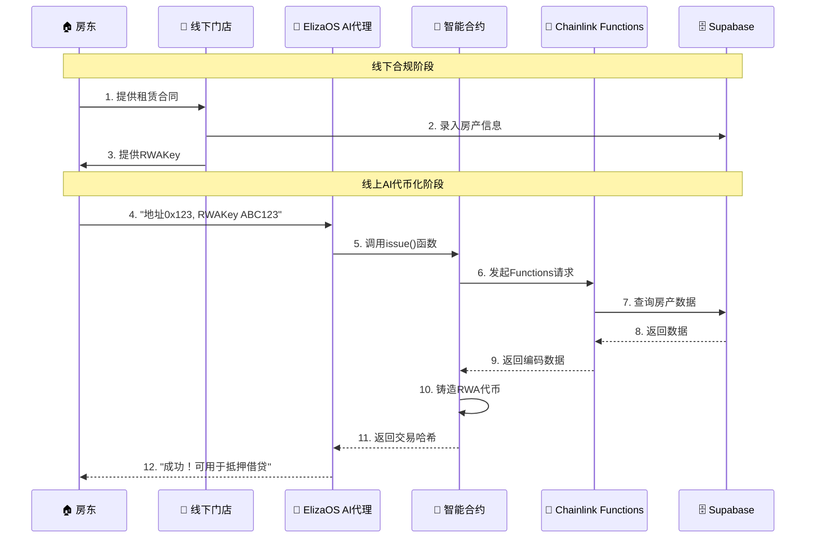

# RentRWA - 增强版演示PPT（包含完整架构图）

## 幻灯片7: 用户交互流程
---
### 完整的时序交互流程



**核心特点:**
- ⚡ **30秒完成**: 从输入到代币铸造
- 🤖 **AI智能**: 自动提取和验证参数
- 🔗 **Chainlink保障**: 去中心化数据获取
- 💰 **即时可用**: 代币立即可用于DeFi

**用户体验:**
```
用户输入: "我的地址是0x208aa722aca42399eac5192ee778e4d42f4e5de3，
         RWA密钥是Nbbut8vlkKe9991Z4Z4，请帮我通证化租金收益"

AI回复: "成功调用合约！交易哈希: 0xdef456...
        您的RWA代币已铸造完成，现在可以用于抵押借贷获得USDC流动资金！"
```

---

## 架构图使用说明

### 1. 幻灯片4的业务流程架构图
- **红色区域**: 线下合规流程，强调法律保障
- **蓝色区域**: 线上AI流程，突出便捷性
- **绿色区域**: Chainlink预言机，确保数据可信
- **紫色区域**: DeFi生态，展示金融价值

### 2. 幻灯片7的时序交互图
- **阶段划分**: 清晰展示线下到线上的转换
- **参与者**: 6个关键角色的交互关系
- **数据流**: 从RWAKey到代币铸造的完整流程
- **时间线**: 强调30秒快速完成的用户体验

### 3. 幻灯片8的DeFi生态循环图
- **四个模块**: 不同颜色标识各功能模块
- **循环箭头**: 展示完整的DeFi生态闭环
- **模块连接**: 清晰展示各功能间的依赖关系
- **用户角色**: 房东和USDC持有者的双赢模式

---

## 演示建议

### 视觉效果
1. **逐步展示**: 可以逐个高亮显示图表的不同部分
2. **颜色引导**: 使用颜色来引导观众注意力
3. **动画效果**: Mermaid图表支持渐进式显示
4. **互动说明**: 指向图表的具体部分进行解释

### 技术亮点强调
1. **线下+线上结合**: 独特的业务模式创新
2. **ElizaOS深度集成**: 完整的AI代理插件系统
3. **Chainlink双重服务**: Functions + Price Feeds
4. **完整DeFi生态**: 四个功能模块形成闭环

### 获奖优势
1. **创新性**: 前所未有的线下+线上结合模式
2. **完整性**: 从概念到实现的完整技术栈
3. **实用性**: 解决真实的房租流动性问题
4. **专业性**: 高质量的架构图展示技术深度

---
