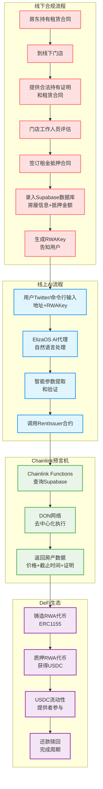
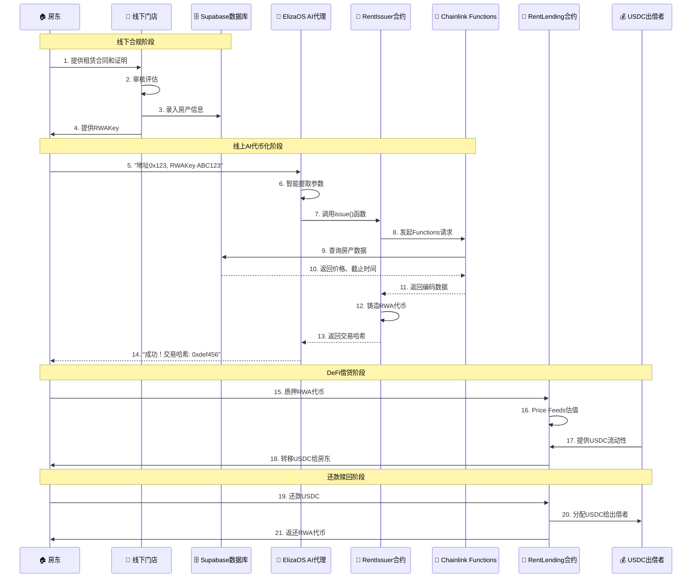

# RentRWA - Chromion Chainlink Hackathon 演示PPT

## 幻灯片1: 标题页
---
### RentRWA
**AI驱动的房地产租金代币化平台**

*Chromion Chainlink Hackathon 2025*

**Building the Future of Onchain Finance**

---

## 幻灯片2: 问题陈述
---
### 当前痛点

🏠 **房租收益流动性不足**
- 房东持有租赁合同，但资金被锁定
- 房租收益无法快速变现获得流动性

🔧 **传统抵押流程复杂**
- 银行抵押手续繁琐，周期长
- DeFi操作对普通用户门槛高

📊 **缺乏可信的链上房租数据**
- 线下租赁合同无法直接上链
- 缺乏去中心化的租金数据验证机制

---

## 幻灯片3: 解决方案
---
### RentRWA = 线下合规 + AI + Chainlink + 房租抵押借贷

#### **💬 线下到线上无缝衔接**
"我的地址是0x123..., RWA密钥是ABC123，请帮我通证化租金收益"

#### **🔗 Chainlink多服务深度集成**
🔧 **Chainlink Functions**
- 从Supabase安全获取房租收益数据
- JavaScript代码在DON网络执行
- 加密存储API密钥

📈 **Chainlink Price Feeds**
- 实时USDC/USD汇率
- 借贷估值计算
- 防止价格操纵

🌐 **Chainlink DON**
- 去中心化预言机网络
- 数据可信性保证
- 抗审查和故障

#### **🤖 ElizaOS AI代理智能化交互**
🧠 **自然语言处理**
- 智能提取钱包地址和RWA密钥
- 上下文理解和多轮对话
- 错误检测和用户引导

🔄 **自动化流程**
- 参数验证和格式检查
- 智能合约调用
- 交易状态跟踪

📱 **多平台支持**
- 命令行聊天界面
- Twitter社交媒体集成
- HTTP API接口

#### **⚡ 用户交互流程**
**用户输入:**
```
"我的钱包地址是0x208aa722aca42399eac5192ee778e4d42f4e5de3，
RWA密钥是Nbbut8vlkKe9991Z4Z4，请帮我代币化房产"
```

**AI代理处理:**
1. � 智能提取参数
2. ✅ 验证地址和密钥格式
3. 🌐 调用Chainlink Functions查询房产数据
4. ⚡ 自动铸造RWA代币
5. 💰 代币可用于抵押借贷USDC

**结果:**
```
"成功调用合约！交易哈希: 0xdef456..."
```

---

## 幻灯片4: 完整业务流程架构
---
### 线下+线上结合的创新模式



---

## 幻灯片5: Chainlink集成深度
---
### 多服务深度集成

🔧 **Chainlink Functions**
- 从Supabase安全获取房租收益数据
- JavaScript代码在DON网络执行
- 加密存储API密钥

📈 **Chainlink Price Feeds**
- 实时USDC/USD汇率
- 借贷估值计算
- 防止价格操纵

🌐 **Chainlink DON**
- 去中心化预言机网络
- 数据可信性保证
- 抗审查和故障

---

## 幻灯片6: ElizaOS AI代理
---
### 智能化用户交互

🧠 **自然语言处理**
- 智能提取钱包地址和RWA密钥
- 上下文理解和多轮对话
- 错误检测和用户引导

🔄 **自动化流程**
- 参数验证和格式检查
- 智能合约调用
- 交易状态跟踪

📱 **多平台支持**
- 命令行聊天界面
- Twitter社交媒体集成
- HTTP API接口

---

## 幻灯片7: 用户交互流程
---
### 一句话完成代币化

**用户输入:**
```
"我的钱包地址是0x208aa722aca42399eac5192ee778e4d42f4e5de3，
RWA密钥是Nbbut8vlkKe9991Z4Z4，请帮我代币化房产"
```

**AI代理处理:**
1. 🔍 智能提取参数
2. ✅ 验证地址和密钥格式
3. 🌐 调用Chainlink Functions查询房产数据
4. ⚡ 自动铸造RWA代币
5. � 代币可用于抵押借贷USDC

**结果:**
```
"成功调用合约！交易哈希: 0xdef456..."
```

---

## 幻灯片8: 完整的DeFi生态
---
### 完整的DeFi交易流程



**核心特点：**
- 🔄 **完整闭环**：四个模块形成完整的DeFi生态循环
- 🤖 **AI驱动**：ElizaOS智能代理简化用户操作
- 🔗 **Chainlink保障**：Functions和Price Feeds确保数据可信
- 💰 **多方共赢**：房东获得流动性，出借者获得收益

---

## 幻灯片9: 技术实现展示
---
### 核心代码实现

**1. Chainlink Functions数据获取:**
```javascript
// FunctionsSource.sol - 从Supabase获取房产数据
const apiResponse = await Functions.makeHttpRequest({
    url: "https://sjqyhjmhwtjbwfolqznu.supabase.co/rest/v1/rent_rwa_lend?select=*",
    method: "GET",
    headers: { "apikey": secrets.apikey }
});
const item = apiResponse.data.find(item => item.rwa_id == rwaKey);
return abiCoder.encode(['uint256','uint256','string'],
    [deadlineTime, item.price, item.proof_url]);
```

**2. AI代理智能合约调用:**
```typescript
// getRwa.ts - ElizaOS插件实现
const getRentIssuerContract = getContract({
    address: contractAddress,
    abi,
    client: walletClient
});
const hash = await getRentIssuerContract.write.issue(userAddr, [rwaKey]);
```

**3. 自然语言处理模板:**
```typescript
// getRwaTemplate - AI智能提取参数
"Your goal is to extract: 1. rwa code, 2. Wallet address"
// AI自动识别: "地址是0x123..., RWA密钥是ABC123"
// 输出: {rwaKey: "ABC123", address: "0x123..."}
```

---

## 幻灯片10: 创新亮点
---
### 技术创新与突破

🚀 **业务模式创新**
- 线下合规+线上便捷的房租抵押借贷
- 四个完整功能模块：代币化→质押→出借→还款
- 传统金融与DeFi的完美结合

🤖 **AI技术创新**
- ElizaOS框架深度集成，支持Twitter等多平台
- 自然语言智能提取钱包地址和RWAKey
- 一句话完成复杂的智能合约调用

🔗 **Chainlink集成创新**
- Functions获取线下审核的房产数据
- Price Feeds实现精确的USDC估值
- DON网络确保数据去中心化可信

---

## 幻灯片11: 市场价值
---
### 巨大的市场潜力

📈 **市场规模**
- 全球房地产市场: $280万亿
- RWA代币化市场快速增长
- DeFi总锁仓量: $1000亿+

👥 **用户群体扩展**
- 小额投资者参与房租收益
- 降低房租投资门槛
- 提升房租收益流动性

💡 **商业价值**
- 交易手续费收入
- 数据服务费
- AI代理订阅模式

---

## 幻灯片12: 技术路线图
---
### 未来发展规划

**Q2 2025: 核心功能**
- ✅ Chainlink Functions集成
- ✅ AI代理基础功能
- ✅ 基础借贷协议

**Q3 2025: 功能扩展**
- 🔄 Chainlink CCIP跨链功能
- 🏢 更多RWA资产类型
- 🤖 高级AI功能

**Q4 2025: 生态建设**
- 🌐 多链部署
- 🏦 机构合作
- 📱 移动端应用

---

## 幻灯片13: 商业模式
---
### 可持续的盈利模式

💰 **收入来源**
- 代币铸造手续费: 0.5%
- 借贷协议手续费: 0.3%
- AI代理订阅费: $10/月

📊 **成本结构**
- Chainlink服务费用
- 云服务和存储
- 开发和运营成本

🎯 **盈利预测**
- 年交易量目标: $100M
- 预期年收入: $500K
- 用户增长: 10K+ 活跃用户

---

## 幻灯片14: 结尾
---
### 谢谢观看！

🌟 **RentRWA - 让房地产投资像聊天一样简单**

📱 **联系我们:**
- GitHub: https://github.com/YumiFly/RentRWA

🏆 **Chromion Chainlink Hackathon 2025**
*Building the Future, Onchain*

**让我们一起用AI和Chainlink重新定义房地产投资！**

---
